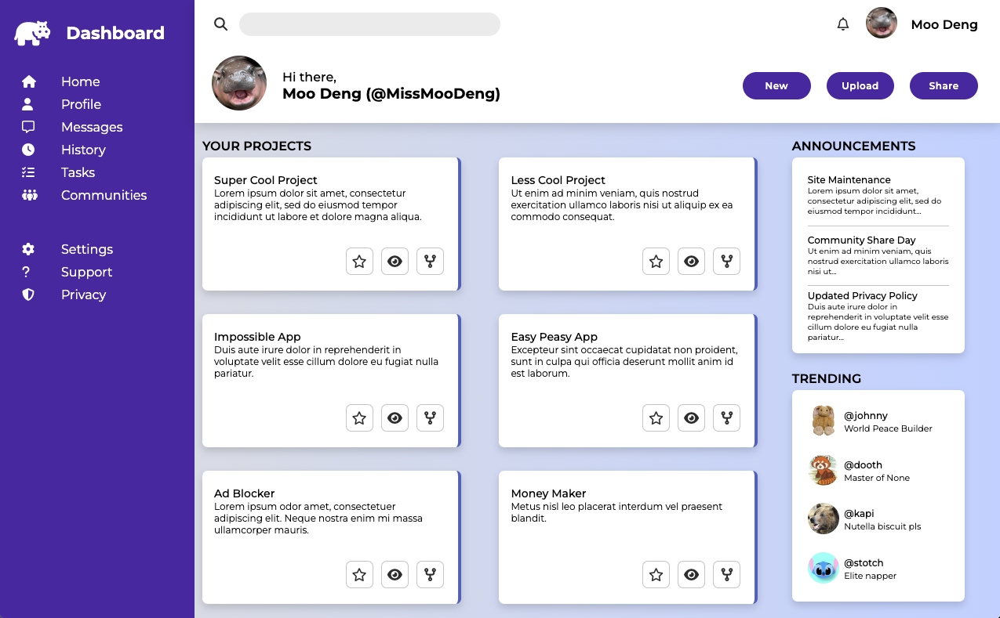

# admin-dashboard

A full admin dashboard using mostly Grid for layout design. 

Combining grid and flexbox to layout the elements on the dashboard. There is a navigation sidebar, header with search and buttons and the main content.

The main content consists of a card container in which the card layout will automatically resize using auto-fit (minmax) property on grid template columns. 

Additionally I used font awesome for the icons and got some extra practice with images and designing with CSS.

[View website](https://golfsap.github.io/admin-dashboard/) or go to: https://golfsap.github.io/admin-dashboard/

## Screenshot

